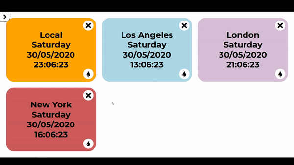

# time-zone-clocks
App that allows the creation of a list of clocks tracking different time zones.

## Getting Started
- Install all dependencies by running `npm install` in the root folder of the project
- Run the suitable npm script
```sh
# Run the app with webpack-dev-server on port 8080 (by default)
npm run start

# Build the production webpack bundle
npm run build

# Build the development webpack bundle
npm run build-dev
```

## Functionality
The app's main menu can be opened by clicking the button in the top-left of the screen. From there, you can set the global date format and the 12/24 hour time format or create a new clock.

To create a new clock select a valid time zone from the list (case-sensitive) and color from the color menu, revealed by clicking the background color field.

Once created, each clock can be removed with the button on its top-right, have its background color changed with the button on its bottom-right or have its order changed by dragging it over a different clock.

All clock information and global settings are stored in the local storage of the browser.



## Author
Borislav Branimirov

## License
This project is licensed under the MIT License 
